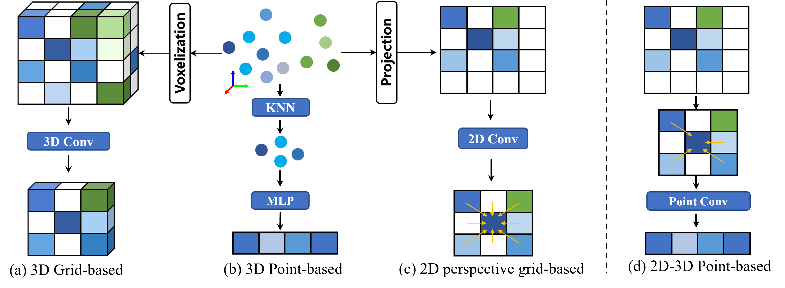
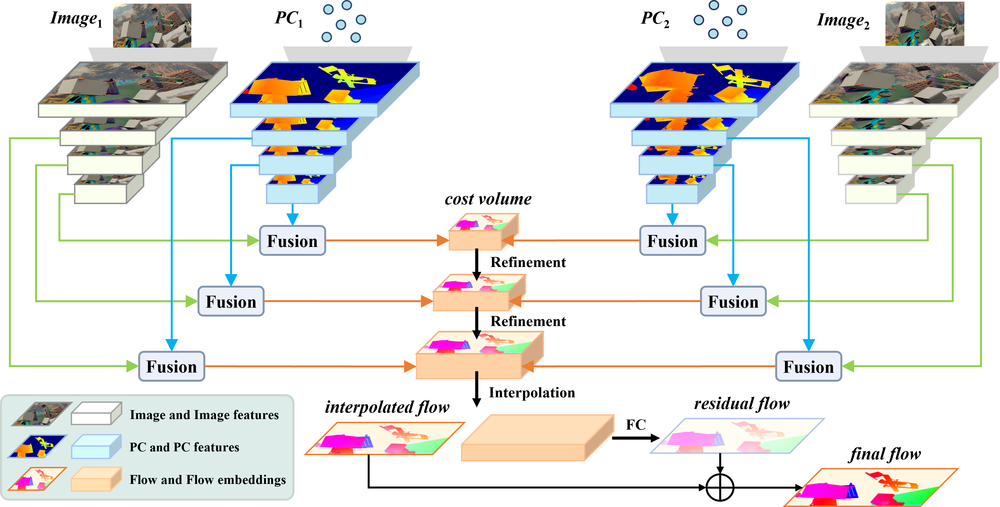
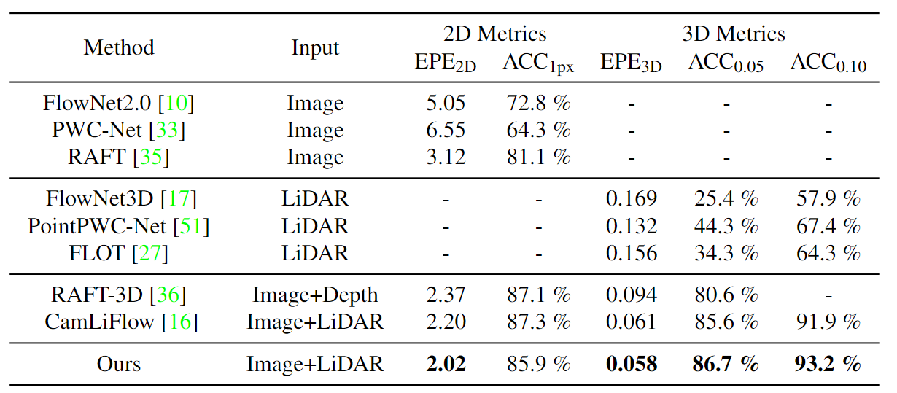

<h1 align="center"> DELFlow: Dense Efficient Learning of Scene Flow for Large-Scale Point Clouds </h1> 

<div class="alert alert-info">
<p align="center">
  
</p>
</div>


## :bookmark_tabs: Table of Contents

1. [Introduction](#clapper-introduction)
2. [Installation](#memo-installation)
3. [Dataset](#file_folder-dataset)
4. [Usage](#computer-usage)
5. [Qualitative Results](#art-visualization)


## :clapper: Introduction

Point clouds are naturally sparse, while image pixels are dense. The inconsistency limits feature fusion from both modalities for point-wise scene flow estimation. Previous methods rarely predict scene flow from the entire point clouds of the scene with one-time inference due to the memory inefficiency and heavy overhead from distance calculation and sorting involved in commonly used farthest point sampling, KNN, and ball query algorithms for local feature aggregation. 

To mitigate these issues in scene flow learning, we regularize raw points to a dense format by storing 3D coordinates in 2D grids. Unlike the sampling operation commonly used in existing works, the dense 2D representation 

- preserves most points in the given scene, 
- brings in a significant boost of efficiency
- eliminates the density gap between points and pixels, allowing us to perform effective feature fusion. 

We also present a novel warping projection technique to alleviate the information loss problem resulting from the fact that multiple points could be mapped into one grid during projection when computing cost volume. Sufficient experiments demonstrate the efficiency and effectiveness of our method, outperforming the prior-arts on the FlyingThings3D and KITTI dataset.

<div class="alert alert-info">
<p align="center">
  
</p>
</div>

For more details, please refer to our [paper](https://openaccess.thecvf.com/content/ICCV2023/html/Peng_DELFlow_Dense_Efficient_Learning_of_Scene_Flow_for_Large-Scale_Point_ICCV_2023_paper.html), [arxiv](https://arxiv.org/abs/2308.04383).


## :memo: Installation

Create a PyTorch environment using `conda`:
```bash
git clone https://github.com/IRMVLab/DELFlow.git
cd DELFlow  
conda env create -f env.yaml
conda activate delflow
```

Compile CUDA extensions
```bash
cd models/csrc
python setup.py build_ext --inplace

cd ops_pytorch/fused_conv_select 
python setup.py install

cd ops_pytorch/gpu_threenn_sample
python setup.py install
```


## :file_folder: Dataset

### FlyingThings3D

First, download and preprocess the [FlyingThings3D subset](https://lmb.informatik.uni-freiburg.de/resources/datasets/SceneFlowDatasets.en.html) dataset, then process them as follows (you may need to change the `input_dir` and `output_dir`):

```bash
python dataset/preprocess_data.py
```

### KITTI

First, download the following parts:

- Main data: [data_scene_flow.zip](https://s3.eu-central-1.amazonaws.com/avg-kitti/data_scene_flow.zip)
- Calibration files: [data_scene_flow_calib.zip](https://s3.eu-central-1.amazonaws.com/avg-kitti/data_scene_flow_calib.zip)
- Disparity estimation (from GA-Net): [disp_ganet.zip](https://drive.google.com/file/d/1ieFpOVzqCzT8TXNk1zm2d9RLkrcaI78o/view?usp=sharing)
- Semantic segmentation (from DDR-Net): [semantic_ddr.zip](https://drive.google.com/file/d/1dVSJeE9BBmVv2rCe5TR0PVanEv2WzwIy/view?usp=sharing)


<details>
  <summary>[Unzip them and organize the directory as follows (click to expand)]</summary>


```
dataset/kitti_scene_flow
├── testing
│   ├── calib_cam_to_cam
│   ├── calib_imu_to_velo
│   ├── calib_velo_to_cam
│   ├── disp_ganet
│   ├── flow_occ
│   ├── image_2
│   ├── image_3
│   ├── semantic_ddr
└── training
    ├── calib_cam_to_cam
    ├── calib_imu_to_velo
    ├── calib_velo_to_cam
    ├── disp_ganet
    ├── disp_occ_0
    ├── disp_occ_1
    ├── flow_occ
    ├── image_2
    ├── image_3
    ├── obj_map
    ├── semantic_ddr
```
</details>


## :computer: Usage

Run the code using the following command:

```python
python train.py config/$config_.yaml$
```

<div class="alert alert-info">
<p align="center">
  
</p>
</div>


## :book: Citation

If you use this codebase or model in your research, please cite:

```
@inproceedings{peng2023delflow,
  title={Delflow: Dense efficient learning of scene flow for large-scale point clouds},
  author={Peng, Chensheng and Wang, Guangming and Lo, Xian Wan and Wu, Xinrui and Xu, Chenfeng and Tomizuka, Masayoshi and Zhan, Wei and Wang, Hesheng},
  booktitle={Proceedings of the IEEE/CVF International Conference on Computer Vision},
  pages={16901--16910},
  year={2023}
}
```


## :art: Visualization

In this section, we present illustrative examples that demonstrate the effectiveness of our proposal.

<div class="alert alert-info">
<p align="center">
  
</p>
</div>


## :pray: Acknowledgements

This code benefits a lot from [CamLiFlow](https://github.com/MCG-NJU/CamLiFlow). Thanks for making codes public available. 
